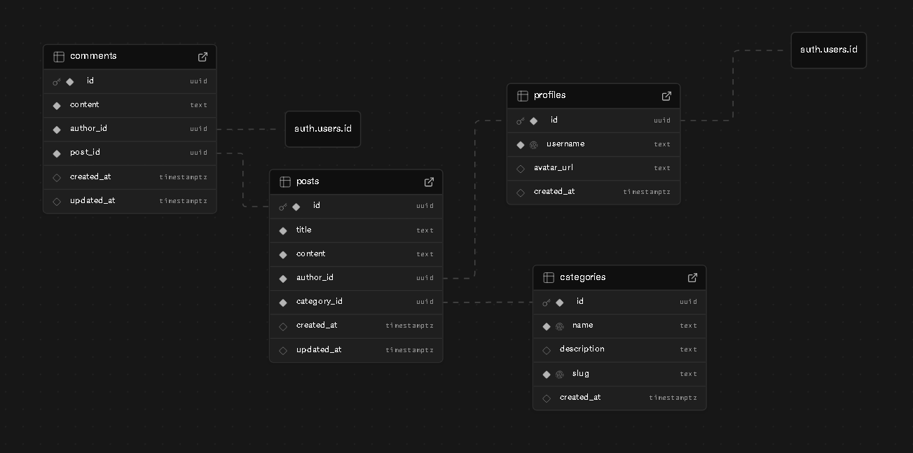

# Forum Educacional

Forum Educacional é uma aplicação web full-stack construída com Node.js e Supabase que permite a criação de comunidades temáticas, publicação de tópicos e interação por meio de comentários. O projeto expõe uma API REST em Express para comunicação com o banco de dados e entrega uma interface web estática com JavaScript moderno para consumo dessa API.

## Visão geral

- **Backend**: servidor Express com rotas para autenticação, posts, categorias, comentários e perfis de usuário. Persistência via Supabase Postgres usando o SDK oficial.
- **Frontend**: páginas estáticas em `public/` (home, login, cadastro e perfil) com JavaScript vanilla responsável por consumir a API e atualizar a interface dinamicamente.
- **Autenticação**: delegada ao Supabase Auth (e-mail/senha). Tokens são armazenados no `localStorage` e enviados em chamadas protegidas.
- **Banco de dados**: script `database-migration.sql` que provisiona tabelas, políticas RLS e dados iniciais (categorias padrão) em um projeto Supabase.

## Pré-requisitos

- [Node.js](https://nodejs.org/) 20 ou superior.
- Conta ativa no [Supabase](https://supabase.com/) com um projeto Postgres configurado.

## Configuração

1. **Clone o repositório**

   ```bash
   git clone <url-do-repositorio>
   cd Forum_Educacional
   ```

2. **Instale as dependências**

   ```bash
   npm install
   ```

3. **Configure variáveis de ambiente**

   Crie um arquivo `.env` na raiz do projeto com as credenciais do seu projeto Supabase:

   ```bash
   VITE_SUPABASE_URL=https://<sua-instancia>.supabase.co
   VITE_SUPABASE_ANON_KEY=<sua-chave-anon>
   SUPABASE_SERVICE_ROLE_KEY=<sua-chave-service-role> # opcional, mas recomendado
   PORT=3000 # opcional
   ```

   > As mesmas variáveis são utilizadas tanto no backend (via `config/supabase.js` e `config/supabaseAdmin.js`) quanto no frontend (build estático em `public/js`). A `SUPABASE_SERVICE_ROLE_KEY` habilita a criação imediata do perfil durante o cadastro; sem ela, o perfil será criado automaticamente no primeiro login confirmado. Nunca exponha a `SUPABASE_SERVICE_ROLE_KEY` no cliente.

4. **Provisionar o banco**

   Utilize o arquivo `database-migration.sql` na aba **SQL Editor** do painel Supabase para criar tabelas, políticas e categorias iniciais.

5. **Executar o servidor**

   ```bash
   npm run dev
   ```

   O servidor ficará disponível em `http://localhost:3000`. As páginas estáticas são servidas diretamente pela aplicação Express.

## Estrutura de pastas

```
├── config/             # Configurações compartilhadas (cliente Supabase)
├── public/             # Assets estáticos (HTML, CSS, JS)
├── routes/             # Rotas Express divididas por domínio
├── server.js           # Entrada da aplicação Express
├── database-migration.sql # Script para criar o schema no Supabase
├── package.json        # Scripts npm e dependências
└── README.md
```

## Principais rotas da API

| Método | Caminho              | Descrição |
| ------ | -------------------- | --------- |
| `GET`  | `/api/posts`         | Lista posts (aceita `?category=<slug>`). |
| `POST` | `/api/posts`         | Cria um post (requer token Supabase e `author_id`). |
| `GET`  | `/api/posts/:id`     | Retorna um post com autor e categoria. |
| `PUT`  | `/api/posts/:id`     | Atualiza título/conteúdo do post. |
| `DELETE` | `/api/posts/:id`   | Remove um post. |
| `GET`  | `/api/categories`    | Lista categorias disponíveis. |
| `GET`  | `/api/comments?post=<id>` | Lista comentários de um post. |
| `POST` | `/api/comments`      | Insere comentário autenticado. |
| `POST` | `/api/auth/signup`   | Cria usuário no Supabase Auth e perfil associado. |
| `POST` | `/api/auth/login`    | Autentica usuário e retorna tokens. |
| `GET`  | `/api/auth/session`  | Valida token e retorna sessão atual. |
| `GET`  | `/api/users/:id`     | Busca perfil público do usuário. |

> Consulte os arquivos dentro de `routes/` para detalhes completos e respostas de erro.

## Fluxo principal da interface

1. Usuário acessa `/` e visualiza a lista de posts carregada de `/api/posts`.
2. Filtro por categoria via botões gera chamadas para `/api/posts?category=<slug>`.
3. Autenticação é feita nas páginas `/login` e `/signup`. Após login, o token é salvo e a UI libera ações protegidas.
4. Criação de posts ocorre pelo modal "Novo Post", com envio autenticado para `/api/posts`.
5. Página de perfil (`/profile/:id`) consome `/api/users/:id` para apresentar dados públicos e posts do autor.

## Scripts disponíveis

- `npm run dev` – inicia o servidor Express em modo desenvolvimento.
- `npm start` – inicia o servidor (alias de `npm run dev`).
- `npm run build` – placeholder; comando pronto para integração com pipelines futuros.

## Schema Visualizer Supabase

